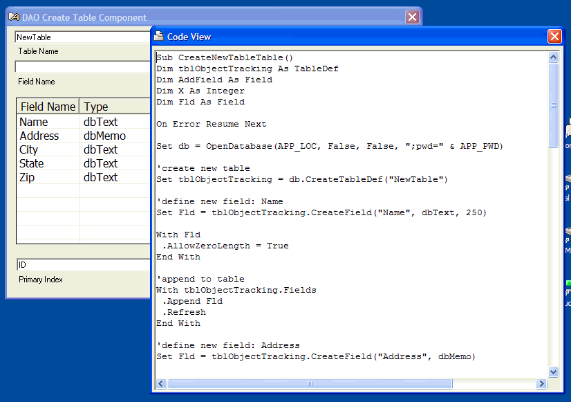



## Create new Table/Fields in Access with no code

### Description

It dynamically writes the code needed to create a new tables/fields in an Access 97 database. You simply add the new fields and it writes the code. This is particularly useful if you have an existing application and wish to add new supporting tables when you release new versions of the software. Uses CreateTableDef and CreateField. This utility has saved me a ton of time.
 
### More Info
 

             |
---                |---
**Submitted On**   |2003-11-05 22:26:34
**By**             |[J Burgess](https://github.com/Planet-Source-Code/PSCIndex/blob/master/ByAuthor/j-burgess.md)
**Level**          |Intermediate
**User Rating**    |5.0 (15 globes from 3 users)
**Compatibility**  |VB 6\.0
**Category**       |[Databases/ Data Access/ DAO/ ADO](https://github.com/Planet-Source-Code/PSCIndex/blob/master/ByCategory/databases-data-access-dao-ado__1-6.md)
**World**          |[Visual Basic](https://github.com/Planet-Source-Code/PSCIndex/blob/master/ByWorld/visual-basic.md)
**Archive File**   |[Create\_new1668291152003\.zip](https://github.com/Planet-Source-Code/j-burgess-create-new-table-fields-in-access-with-no-code__1-49696/archive/master.zip)

